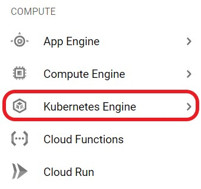
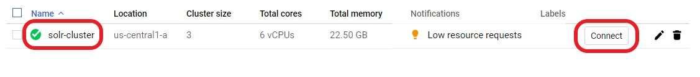
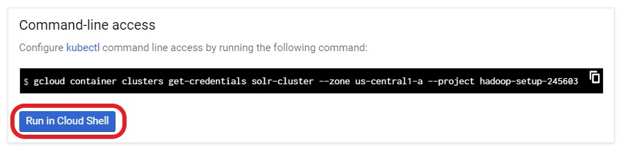
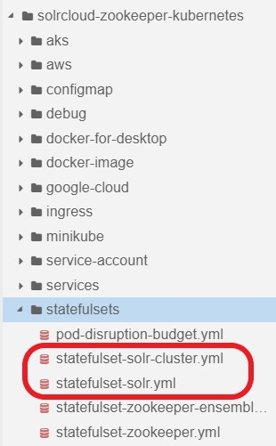
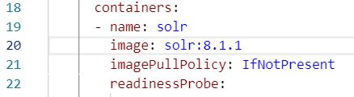
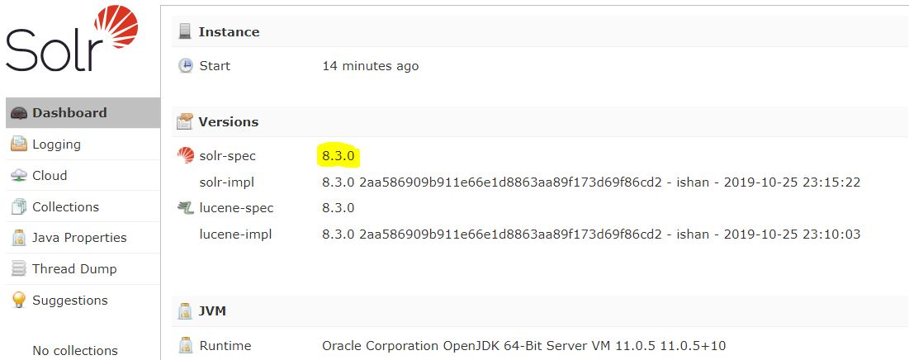
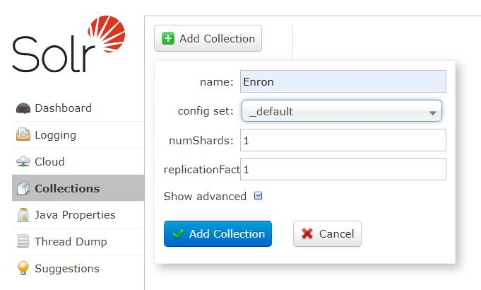
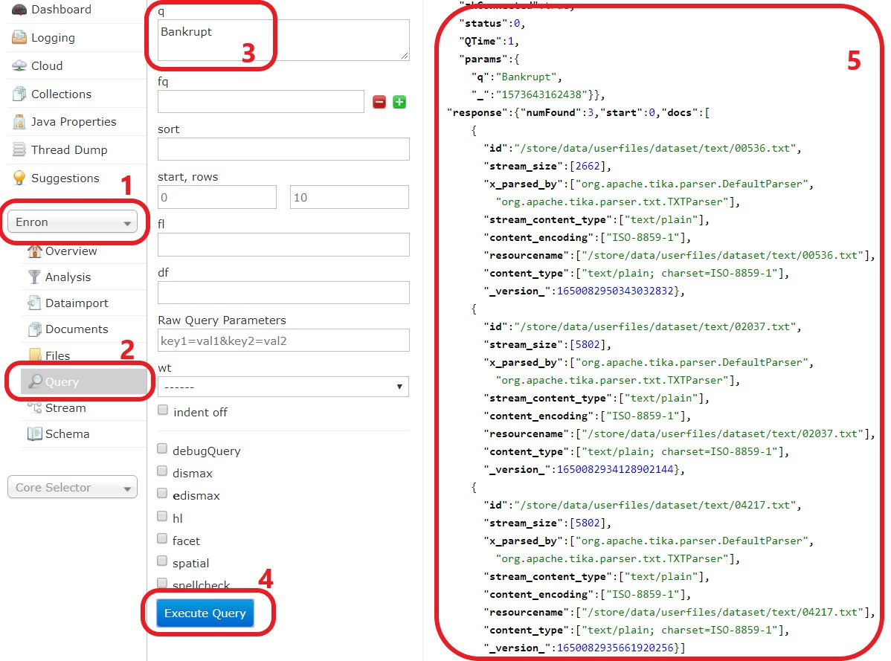

# Solr Intro:

## 1.2-install-Kubernetes-GCP

In this lab we will practice the installation of the Solr on Kubernetes on GCP.

Lab Goals:

* Install Solr on Kubernetes on GCP and verify its operation
* Prepare to use this install for all subsequent labs

### STEP 1) Login to the [GCP](https://console.cloud.google.com/)

Each student is provided his/her GCP account and credentials

(Instructor: use [GCP Free Tier](https://cloud.google.com/free/))

### STEP 2) Created a sample cluster

In this lab we will use Google Cloud Shell


**Created a sample cluster(solr-cluster) in your GCP account using the following gcloud command:**

```bash
    $ gcloud beta container --project $DEVSHELL_PROJECT_ID clusters create "solr-cluster" --zone "us-central1-a" --username "admin" --cluster-version "1.13.11-gke.9" --machine-type "n1-standard-2" --image-type "COS" --disk-type "pd-standard" --disk-size "100" --scopes "https://www.googleapis.com/auth/devstorage.read_only","https://www.googleapis.com/auth/logging.write","https://www.googleapis.com/auth/monitoring","https://www.googleapis.com/auth/servicecontrol","https://www.googleapis.com/auth/service.management.readonly","https://www.googleapis.com/auth/trace.append" --num-nodes "3" --enable-stackdriver-kubernetes --metadata disable-legacy-endpoints=true --enable-ip-alias --network "projects/$DEVSHELL_PROJECT_ID/global/networks/default" --subnetwork "projects/$DEVSHELL_PROJECT_ID/regions/us-central1/subnetworks/default" --default-max-pods-per-node "110" --addons HorizontalPodAutoscaling,HttpLoadBalancing --enable-autoupgrade --enable-autorepair
```

```console
    kubeconfig entry generated for solr-cluster.
    NAME          LOCATION       MASTER_VERSION  MASTER_IP     MACHINE_TYPE   NODE_VERSION   NUM_NODES  STATUS
    solr-cluster  us-central1-a  1.13.11-gke.9   23.236.52.84  n1-standard-2  1.13.11-gke.9  3          RUNNING
```

### STEP 3) Connect to the cluster

**3.1 From the left menu select `Kubernetes Engine`**



**3.2 Now you should see the cluster `solr-cluster`**

**3.3 Click on `Connect` button**



**3.4 Click on `Run in Cloud Shell` button or copy and following gcloud command:**



```bash
    $ gcloud container clusters get-credentials solr-cluster --zone us-central1-a --project $DEVSHELL_PROJECT_ID

```

### Step 4) Clone and edit installer bash script

**4.1 Clone**

```bash
    $ git clone https://github.com/freedev/solrcloud-zookeeper-kubernetes.git
```

**4.2 Lunch cloud Editor**


**4.3 Edit these two file to install Solr with latest version**

```bash
    solrcloud-zookeeper-kubernetes/statefulsets/statefulset-solr-cluster.yml

    solrcloud-zookeeper-kubernetes/statefulsets/statefulset-solr.yml
```



[Check the latest Solr official image version](https://hub.docker.com/_/solr)

**4.3.1 Click on `statefulset-solr-cluster.yml`**

**4.3.2 Find `Image: image: solr:8.1.1` (at line #20 & #109) then change it to `Image: image: solr:8.3.0`**



**4.3.3 Do Step **4.3.2** for `statefulset-solr.yml`**

### STEP 5) Install Solr with the script

**=> Execute the following Commands:**

```bash
    $ cd solrcloud-zookeeper-kubernetes

    $ ./start.sh
```    

You will see the following output:

```console

configmap/solr-config created
configmap/zookeeper-config created
statefulset.apps/zk created
service/zkensemble created
service/zk-service created
statefulset.apps/solr created
service/solrcluster created
service/solr-service created
NAME     READY   STATUS              RESTARTS   AGE
solr-0   0/1     Pending             0          1s
zk-0     0/1     ContainerCreating   0          17s
No resources found.
NAME           TYPE           CLUSTER-IP   EXTERNAL-IP   PORT(S)          AGE
kubernetes     ClusterIP      10.0.0.1     <none>        443/TCP          59m
solr-service   LoadBalancer   10.0.0.128   <pending>     8983:32601/TCP   0s
solrcluster    ClusterIP      None         <none>        <none>           0s
zk-service     LoadBalancer   10.0.0.8     <pending>     2181:32231/TCP   16s
zkensemble     ClusterIP      None         <none>        <none>           16s
```

**=> To find the services load balancer just run:**

```bash
    $ kubectl get services
```

```console
NAME           TYPE           CLUSTER-IP   EXTERNAL-IP     PORT(S)          AGE
kubernetes     ClusterIP      10.0.0.1     <none>          443/TCP          63m
solr-service   LoadBalancer   10.0.0.128   35.193.53.168   8983:32601/TCP   3m36s
solrcluster    ClusterIP      None         <none>          <none>           3m36s
zk-service     LoadBalancer   10.0.0.8     34.69.32.164    2181:32231/TCP   3m52s
zkensemble     ClusterIP      None         <none>          <none>           3m52s
```

When your cluster is successfully started, you need to understand how to reach the Solr instance. You can use `kubectl`

**=> To find the port:**

```bash
    $ kubectl get svc solr-service -o json | jq ".spec.ports[0] | .nodePort"

    32601
```

**=> To find the public IP:**

```bash
    $ kubectl get nodes -o json | jq '.items[0] | .status.addresses[] | select(.type | contains("ExternalIP")) | .address'

    "35.224.245.18"
```

Now open the IP address with the port in your browser.  
In this sample : `35.224.245.18:32601`

> If your node is still not reachable, probably it's because of Google cloud default network firewall rules.

```bash
    #Change the command with your port.
    
    $ gcloud compute firewall-rules create allow-32601-from-everywhere --allow=TCP:32601 --direction=INGRESS

Creating firewall...⠧Created [https://www.googleapis.com/compute/v1/projects/$DEVSHELL_PROJECT_ID/global/firewalls/allow-32601-from-everywhere].
Creating firewall...done.
NAME                         NETWORK  DIRECTION  PRIORITY  ALLOW      DENY  DISABLED
allow-32601-from-everywhere  default  INGRESS    1000      tcp:32601        False
```

You will be redirected to the Solr admin console



### STEP 6) Creating a collection  

- Click on  Collections on the left menu
- Click on  Add Collection (for e.g. Enron)
- Input name 
- Open config set and select **__default**  
- input 1 for **numShards**
- input 1 for **replicationFactor**

  

### STEP 7) Indexing data

Back to GCP shell

**=> Following these commmands**

```bash
    $ kubectl kubectl exec -it solr-0 bash
```

```console
    solr@solr-0:/opt/solr-8.3.0$
```

```bash
    solr@solr-0:/opt/solr-8.3.0$ cd /store/data/userfiles
```

```bash
    solr@solr-0:/store/data/userfiles$ wget https://s3.amazonaws.com/freeeed.org/enron/results/enron001.zip
```


```bash
    solr@solr-0:/store/data/userfiles$ mkdir dataset
```


```bash
    solr@solr-0:/store/data/userfiles$ unzip enron001.zip -d dataset/
```


```bash
    solr@solr-0:/store/data/userfiles$ cd /opt/solr/bin/
```


```bash
    solr@solr-0:/opt/solr/bin$ ./post -c  Enron /store/data/userfiles/dataset
```

These operations could take minutes.

once you get the following result, you are done indexing and you can start creating search queries in Solr.


```console
4768 files indexed.
COMMITting Solr index changes to http://localhost:8983/solr/Enron/update...
Time spent: 0:00:44.018
```

### STEP 8) Test with simple query  

1. From the left menu on the first dropdown select `Enron`.

2. Click on `Query`.

3. Type `Bankrupt` in `q` field.

4. From the bottom of page click on `Execute Query` button.

Now you should see the result.

 