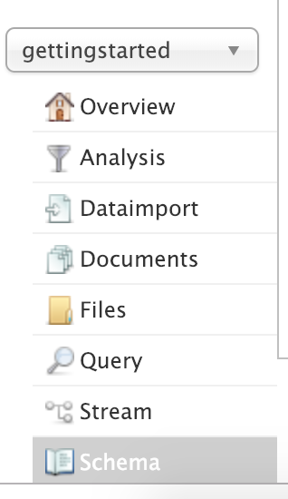

# Solr Intro:

## 1-Install

In this lab we will practice changing the schema.


Lab Goals:

* Be able to browse and change the schema
* Get used to the idea of changing it using the API rather than XML files.

### STEP 1) Stop solr and restart with `gettingstarted` schema

Let's not muck around with the `techproducts` schema we've been working on. Instead, let us restart solrcloud and run
the default gettingstarted schema. 

```bash
bin/solr stop -all
bin/solr start -e cloud
```

This time, just accept all the defaults.

### Step 2) Retrieve the schema

```bash
curl http://localhost:8983/solr/gettingstarted/schema
```

The response will be very lengthy, in JSON format, a sample is like this:

```json
{
  "responseHeader":{
    "status":0,
    "QTime":9},
  "schema":{
    "name":"default-config",
    "version":1.6,
    "uniqueKey":"id",
    "fieldTypes":[{
        "name":"ancestor_path",
        "class":"solr.TextField",
        "indexAnalyzer":{
          "tokenizer":{
            "class":"solr.KeywordTokenizerFactory"}},
        "queryAnalyzer":{
          "tokenizer":{
            "class":"solr.PathHierarchyTokenizerFactory",
            "delimiter":"/"}}},
      {
        "name":"binary",
        "class":"solr.BinaryField"},
      {
        "name":"boolean",
        "class":"solr.BoolField",
        "sortMissingLast":true},
      {
        "name":"booleans",
        "class":"solr.BoolField",
        "sortMissingLast":true,
        "multiValued":true},
{
        "name":"*_p",
        "type":"location",
        "indexed":true,
        "stored":true}],
    "copyFields":[]}}
```


 
### STEP 3) Add a New Field

```bash
curl -X POST -H 'Content-type:application/json' --data-binary '{
  "add-field":{
     "name":"sell_by",
     "type":"pdate",
     "stored":true }
}' http://localhost:8983/solr/gettingstarted/schema
```


You should get a response like this

```console
{ "responseHeader":{
    "status":0,
    "QTime":1662}}
```

Again retrive the schema. It will be long, but try to find your new field.

```bash
curl http://localhost:8983/solr/gettingstarted/schema
```

```json
 {
         "name":"sell_by",
         "type":"pdate",
         "stored":true}
```


Go ahead and open up your solr Web API in the browser

```text
http://YOURIPADDRESS:8983/solr/
```

On the dropdown on the left, select `gettingstarted` and select `Schema` as shown



Or you can go directly:

```text
http://YOURIPADDRESS:8983/solr/#/gettingstarted/schema?field=sell_by
```

### STEP 3) Delete a Field

Now delete your new field

```bash
curl -X POST -H 'Content-type:application/json' --data-binary '{
  "delete-field" : { "name":"sell_by" }
}' http://localhost:8983/solr/gettingstarted/schema
```

Retrive the schema and witness it is no longer there.

```bash
curl http://localhost:8983/solr/gettingstarted/schema
```

### STEP 4) Replace a field.

You can replace a field. But first it has to exist.  So, let's add our sell by fild back again.


```bash
curl -X POST -H 'Content-type:application/json' --data-binary '{
  "add-field":{
     "name":"sell_by",
     "type":"pdate",
     "stored":true }
}' http://localhost:8983/solr/gettingstarted/schema
```

Now that it should be back, now let's *replace* the field with a different ype `date`.

```bash
curl -X POST -H 'Content-type:application/json' --data-binary '{
  "replace-field":{
     "name":"sell_by",
     "type":"date",
     "stored":false }
}' http://localhost:8983/solr/gettingstarted/schema
```

### STEP 5) Dynamic Field Rules

Dyanamic field rules allow us to set a rule about a field. For example, we can say that all field ending 
in `_s` should be of type string.


```bash
curl -X POST -H 'Content-type:application/json' --data-binary '{
  "add-dynamic-field":{
     "name":"*_s",
     "type":"string",
     "stored":true }
}' http://localhost:8983/solr/gettingstarted/schema
```

Let's list all the dynamic fields:

```bash
curl http://localhost:8983/solr/gettingstarted/schema/dynamicfields
```


Let's try listing the new dynamic field we just created:

```bash
curl "http://localhost:8983/solr/gettingstarted/schema/dynamicfields/*_s"
```


Now, let's use a replace to change the type from `string` to `text_general`:

```bash
curl -X POST -H 'Content-type:application/json' --data-binary '{
  "replace-dynamic-field":{
     "name":"*_s",
     "type":"text_general",
     "stored":false }
}' http://localhost:8983/solr/gettingstarted/schema
```

Let's try again listing the new dynamic field we just created:

```bash
curl "http://localhost:8983/solr/gettingstarted/schema/dynamicfields/*_s"
```

Now let's delete the rule.

```bash
curl -X POST -H 'Content-type:application/json' --data-binary '{
  "delete-dynamic-field":{ "name":"*_s" }
}' http://localhost:8983/solr/gettingstarted/schema
```

Verify it is gone:


```bash
curl "http://localhost:8983/solr/gettingstarted/schema/dynamicfields/*_s"
```


### Step 6) Add a new Field Type

Let us create a new field called `myNewTxtField`

We will create it with the following anayzer:
  * PatternReplaceCharFilter
  * WhiteSpaceTokenizer
  * Word Delimeter

```bash
curl -X POST -H 'Content-type:application/json' --data-binary '{
  "add-field-type" : {
     "name":"myNewTxtField",
     "class":"solr.TextField",
     "positionIncrementGap":"100",
     "analyzer" : {
        "charFilters":[{
           "class":"solr.PatternReplaceCharFilterFactory",
           "replacement":"$1$1",
           "pattern":"([a-zA-Z])\\\\1+" }],
        "tokenizer":{
           "class":"solr.WhitespaceTokenizerFactory" },
        "filters":[{
           "class":"solr.WordDelimiterFilterFactory",
           "preserveOriginal":"0" }]}}
}' http://localhost:8983/solr/gettingstarted/schema

```

Let's list our field types:

```bash
curl http://localhost:8983/solr/gettingstarted/schema/fieldtypes

```


Let's look specifically for the new one:

```bash
curl http://localhost:8983/solr/gettingstarted/schema/fieldtypes/myNewTxtField
```

Now let's change our new field to have a different set of filters:

This time, we have simply the `StandardTokenizer`

```bash
curl -X POST -H 'Content-type:application/json' --data-binary '{
  "replace-field-type":{
     "name":"myNewTxtField",
     "class":"solr.TextField",
     "positionIncrementGap":"100",
     "analyzer":{
        "tokenizer":{
           "class":"solr.StandardTokenizerFactory" }}}
}' http://localhost:8983/solr/gettingstarted/schema
```

Let's check out the modified text field, see what it looks like:

```bash
curl http://localhost:8983/solr/gettingstarted/schema/fieldtypes/myNewTxtField
```

Now let's delete our new field:

```bash
curl -X POST -H 'Content-type:application/json' --data-binary '{
  "delete-field-type":{ "name":"myNewTxtField" }
}' http://localhost:8983/solr/gettingstarted/schema
```


### Step 7) Add a new Field Type With Two Analyzers

Now we are going to add a new fieldtype with two separate analyzers. The last example had one analyzer (with 
several filters as part of the analyzer).

```bash

curl -X POST -H 'Content-type:application/json' --data-binary '{
  "add-field-type":{
     "name":"myNewTextField",
     "class":"solr.TextField",
     "indexAnalyzer":{
        "tokenizer":{
           "class":"solr.PathHierarchyTokenizerFactory",
           "delimiter":"/" }},
     "queryAnalyzer":{
        "tokenizer":{
           "class":"solr.KeywordTokenizerFactory" }}}
}' http://localhost:8983/solr/gettingstarted/schema

```

Let's check out the modified field type, see what it looks like:

```bash
curl http://localhost:8983/solr/gettingstarted/schema/fieldtypes/myNewTxtField
```

### Step 8: Copy fields

Copy fields allow you to make a certain field interpreted more than one way. 

The following fields have to be defined:

* source:  The source field. This parameter is required.
* dest:  A field or an array of fields to which the source field will be copied. This parameter is required.
* maxChars The upper limit for the number of characters to be copied. 

Let's copy field `shelf` to field `catchall`

```bash
curl -X POST -H 'Content-type:application/json' --data-binary '{
  "add-copy-field":{
     "source":"shelf",
     "dest":[ "location", "catchall" ]}
}' http://localhost:8983/solr/gettingstarted/schema
```

Let us now confirm that we did add the copy field:

```bash
curl http://localhost:8983/solr/gettingstarted/schema/copyfields
```

And let's delete the same:

```bash
curl -X POST -H 'Content-type:application/json' --data-binary '{
  "delete-copy-field":{ "source":"shelf", "dest":"location" }
}' http://localhost:8983/solr/gettingstarted/schema

```


