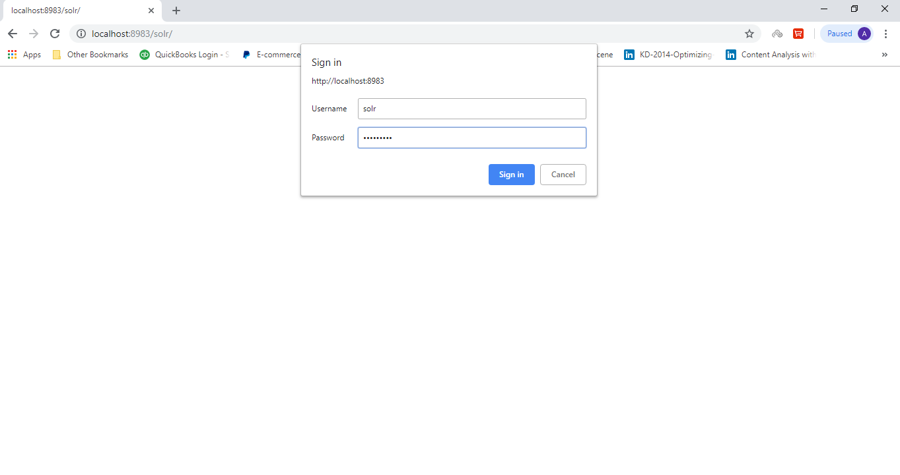

# Solr Basic Authentication

In this lab we will practice enabling basic authentication on the standalone Solr server.


Lab Goals:

* Enabling solr authentication
* Adding and deleting users

### STEP 1) Creating and placing appropriate file
1 Go to the directory `$SOLR_HOME/server/solr`
2 Create a file named `security.json` with the following content:

```bash
{
"authentication":{
   "blockUnknown": true,
   "class":"solr.BasicAuthPlugin",
   "credentials":{"solr":"IV0EHq1OnNrj6gvRCwvFwTrZ1+z1oBbnQdiVC3otuq0= Ndd7LKvVBAaZIF0QAVi1ekCfAJXr1GGfLtRUXhgrF8c="}
},
"authorization":{
   "class":"solr.RuleBasedAuthorizationPlugin",
   "permissions":[{"name":"security-edit",
      "role":"admin"}],
   "user-role":{"solr":"admin"}
}}
```

### STEP 2) Starting Solr and Login

1 Start the solr 

```bash
$bin/solr start
```

2 Browse: 

```bash
MYIPADDRESS:8983
```

3 Login by this credential: Username = `solr` and password = 'SolrRocks'



### STEP 3) Adding a user

Enter the following command in terminal

```bash
curl --user solr:SolrRocks http://localhost:8983/solr/admin/authentication -H
'Content-type:application/json' -d '{
    "set-user":{"bob":"secret"}}'
```

### STEP 4) Deleting a user

Enter the following command in terminal

```bash
curl --user solr:SolrRocks http://localhost:8983/solr/admin/authentication -H
'Content-type:application/json' -d '{
    "delete-user":{"bob":"secret"}}'
```


