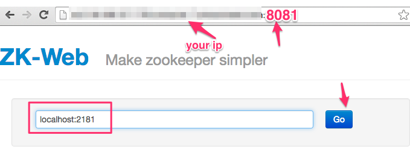
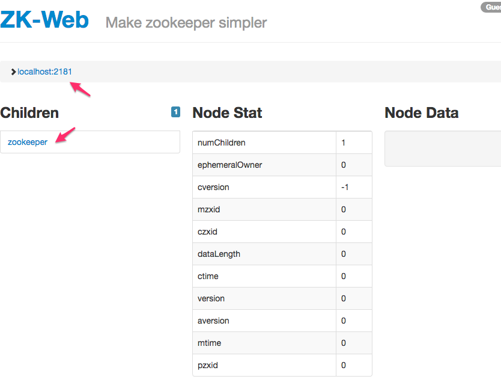

<link rel='stylesheet' href='../assets/css/main.css'/>

[<< back to main index](../README.md)

Lab 1.1 : Run Zookeeper
=====================

### Overview
Install and run Zookeeper

### Depends On
None

### Run time
10 mins


## Step 1 : Install Zookeeper
Try this in terminal
```bash
    $   cd

    $   tar xvf ~/files/zookeeper-3.4.12.tar.gz

    # rename for easy referral
    $   mv zookeeper-3.4.12     zookeeper

    ## Getting another version
    # $   wget -O  ~/files/zookeeper-3.4.12.tar.gz    http://apache.cs.utah.edu/zookeeper/zookeeper-3.4.12/zookeeper-3.4.12.tar.gz

```


## Step 2 :  Configure Zookeeper
We have a sample config file for zookeeper.  It is in  `config/zk/zoo.cfg`.  The content looks like this

```
tickTime=2000
dataDir=/home/ubuntu/zookeeper-data
clientPort=2181
```

Copy this file into '~/zookeeper/conf' directory as follows.

```
    $   cp ~/config/zk/zoo.cfg    ~/zookeeper/conf/zoo.cfg
```


## Step 3:  Create a zookeeper data directory
```
    $    mkdir ~/zookeeper-data
```

## Step 4: Start the zookeeper server
```
    $  ~/zookeeper/bin/zkServer.sh start
```

## Step 5:  Verify Zookeeper is running
Using JPS command
```bash
    $  jps
```
If we see a process named 'QuorumPeerMain' then zookeeper is running

```console
67875 QuorumPeerMain
67732
67878 Jps
```


### Option 1  : Simple telnet
```bash
    $   telnet localhost 2181
    ....
    # enter srvr

    srvr
```

Output may look like this:
```console
Trying 127.0.0.1...
Connected to localhost.
Escape character is '^]'.
srvr
Zookeeper version: 3.4.8--1, built on 02/06/2016 03:18 GMT
Latency min/avg/max: 0/0/0
Received: 1
Sent: 0
Connections: 1
Outstanding: 0
Zxid: 0x0
Mode: standalone
Node count: 4
Connection closed by foreign host.
```


### Option 2  : Zookeeper client
```
    $   ~/zookeeper/bin/zkCli.sh  -server  localhost:2181
```

This will drop you into ZKCLI.  Try these commands  in shell.
```
    >   help
    >   stat /
    >   quit
```


### Option 3 : Web UI
We can also use [zk-web](https://github.com/qiuxiafei/zk-web) to examine zookeeper.

```
    $    cd  ~/apps/zk-web

    $    nohup lein run  &

    $    cd
```

zk-web can be accessed via port 8081.  
Go to http://your_ip_address:8081 in a browser.  Substitute your own machine IP.



You would see an output like this:



**Good, Zookeeper is now up and running**  
